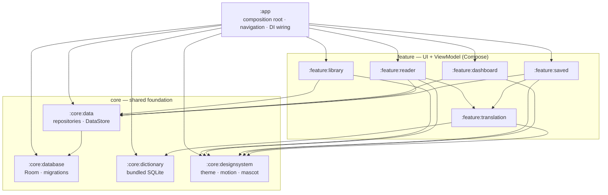
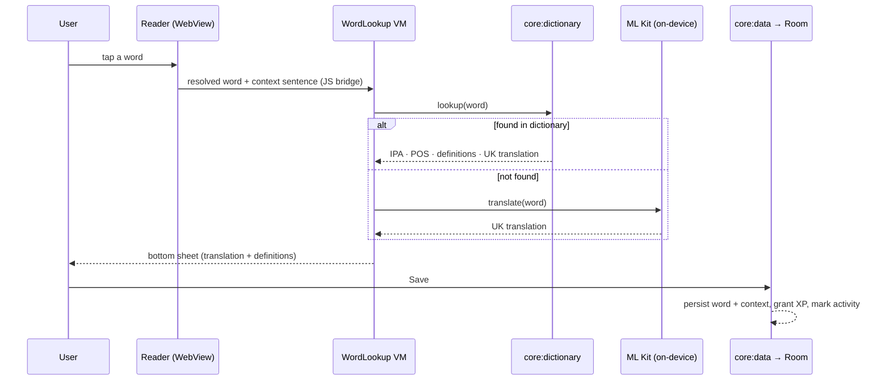

# Architecture

Lexora is a multi-module Android app built on a strict dependency direction:
**UI features depend on shared core modules — never the other way around, and
(almost) never on each other.** This keeps each feature buildable and testable
in isolation, and lets Gradle compile the modules in parallel.

## Module graph

## Layers

- **`:app`** — the composition root. Owns the `Application`, the single
  `MainActivity`, the navigation host (bottom-nav tabs + reader/review routes),
  and the Hilt entry point. It wires modules together but holds no feature logic.
- **`:feature:*`** — one screen-area each (library, reader, saved words,
  dashboard, translation). Each is Compose UI + a `ViewModel`, and talks to the
  data layer through repository interfaces. Features are independent of one
  another with one deliberate exception: **`:feature:translation`** is a shared
  feature module (the word/sentence translation UI + ML Kit engine), consumed by
  both `:feature:reader` and `:feature:saved`.
- **`:core:data`** — the integration layer. Exposes repositories
  (`LibraryRepository`, `SavedWordsRepository`, `BookmarksRepository`,
  `ActivityRepository`, `XpRepository`, `ReaderPreferencesRepository`) backed by
  Room and DataStore. Features depend on this, not on the database directly.
- **`:core:database`** — Room entities, DAOs, and versioned migrations. The only
  module that knows the SQL schema.
- **`:core:dictionary`** — the bundled offline dictionary (prebuilt SQLite in
  assets) and its lookup repository, including inflected-form resolution.
- **`:core:designsystem`** — the Ember theme, typography, color tokens, motion
  primitives (`AppearOnce`, `AnimatedCount`, confetti), and the Lexi mascot.
  Pure UI, no business logic; depended on by every UI module.

## Design decisions

- **Offline-first, no backend.** There is no server, account, or API key. The
  dictionary ships as a bundled SQLite asset and machine translation runs
  on-device via Google ML Kit (models downloaded once, then cached). This is the
  defining constraint — it shapes the data layer, privacy story, and the
  "connect once to download the model" UX.
- **Readium for EPUB rendering.** Parsing and rendering EPUBs is delegated to the
  [Readium Kotlin toolkit](https://github.com/readium/kotlin-toolkit) (BSD-3)
  rather than a hand-rolled engine. `:feature:reader` hosts Readium's
  `EpubNavigatorFragment` via Compose interop and layers tap/long-press word
  resolution, highlighting, search, and bookmarks on top.
- **Room + DataStore split.** Structured, queryable, relational data (books,
  saved words, bookmarks, daily activity) lives in **Room**; small key-value
  settings (reading appearance, brightness, rotation lock, XP, streak metadata)
  live in **DataStore**. Each tool is used for what it is good at.
- **Multi-module by responsibility.** Modules are split by responsibility, not by
  technical layer, so files that change together live together. The payoff is
  parallel builds, enforced dependency direction, and the ability to unit-test a
  feature without the rest of the app.
- **Heavy work off the main thread.** EPUB opening and position/TOC computation
  run on an injected `@IoDispatcher` (swappable in tests), so opening a book
  never blocks the UI. Reading-tab navigation uses lightweight transitions and
  saveable entrance state to stay smooth.
- **Compose + Hilt throughout.** 100% Jetpack Compose UI, Material 3, with Hilt
  for dependency injection. ViewModels expose `StateFlow`; repositories expose
  cold `Flow`s observed by the UI.

## Data flow — tap to translate

Saved words then feed the **review** flow (SM-2 spaced repetition in
`:feature:saved`) and the **dashboard** (streak, heatmap, XP, daily goal in
`:feature:dashboard`), both reading the same `:core:data` repositories.

## Tech stack

| Concern | Choice |
| --- | --- |
| Language / UI | Kotlin · Jetpack Compose · Material 3 |
| DI | Hilt |
| Persistence | Room (schema v6 + migrations) · DataStore |
| Async | Coroutines · Flow / StateFlow |
| EPUB | Readium Kotlin toolkit 3.x |
| Translation | Google ML Kit (on-device EN→UK) · bundled SQLite dictionary |
| Build | Gradle (Kotlin DSL) · version catalog · R8 + ABI splits · `minSdk 26 / target 36` |
| Tests | JUnit · Robolectric · Compose UI tests |

For day-to-day usage, see [`docs/USAGE.md`](docs/USAGE.md).
