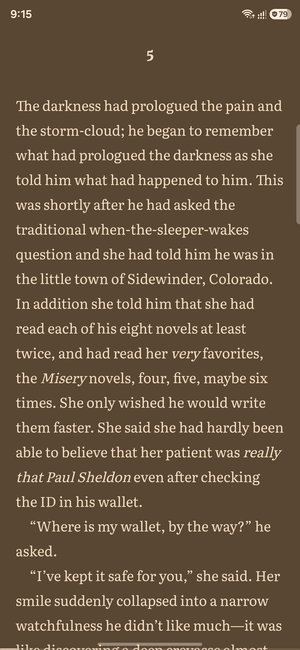
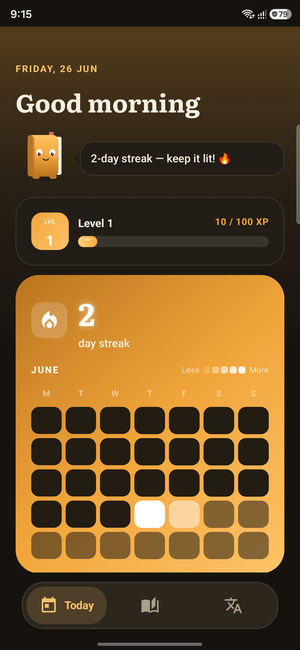
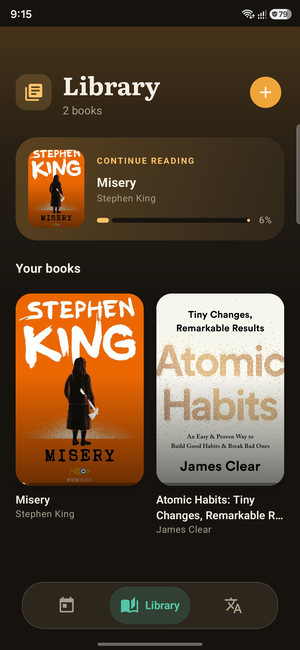
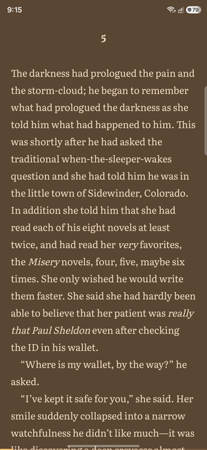
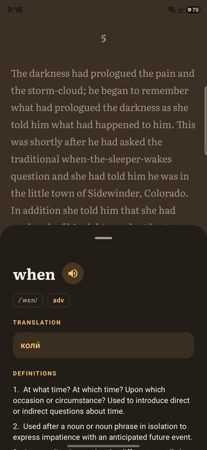

# Lexora

[](https://github.com/mkvSKYi/Lexora/actions/workflows/ci.yml)

**Read English books. Learn the words.**

Lexora is an offline Android EPUB reader that turns every page into a vocabulary
lesson. Tap any word for an instant Ukrainian translation and dictionary entry,
save what you want to remember, and read in a calm, fully themeable interface.

No account, no network, no API keys — translation, the dictionary, and the fonts
are all bundled.

## Demo

<p align="center">
  
</p>

<p align="center">
  
  
  
  
</p>

## Highlights

- **Tap to translate.** One tap on a word → IPA, part of speech, definitions, and
  a Ukrainian translation. Long-press to translate a whole sentence.
- **Build your vocabulary.** Save words, mark them *learned*, filter and track
  progress, and reopen any word's definitions later.
- **Read your way.** 9 themes (incl. Nord, Solarized, Gruvbox, Paper), 5 premium
  fonts (Literata, Lora, Atkinson Hyperlegible, Inter, OpenDyslexic), and a
  right-edge swipe for brightness.
- **A library that feels good.** Generated cover art, continue-reading, per-book
  progress.

➡️ **Using the app:** [`docs/USAGE.md`](docs/USAGE.md)

## Built with

Kotlin · Jetpack Compose · Material 3 · Hilt · Room · Coroutines/Flow ·
[Readium](https://github.com/readium/kotlin-toolkit) · Google ML Kit (offline
EN→UK) · a bundled 40k-word Wiktionary dictionary.

The codebase is multi-module by responsibility (`:core:*`, `:feature:*`).

## Run it

Android Studio (JDK 21), Android SDK (compileSdk 36), a device/emulator on API 26+.

```bash
./gradlew :app:installDebug      # build + install
./gradlew testDebugUnitTest      # tests
```

Nothing to configure — Lexora is offline-first.

## Licenses

Bundled fonts are SIL OFL 1.1 (`feature/reader/src/main/assets/fonts/LICENSES.txt`).
Dictionary data derives from English Wiktionary via [kaikki.org](https://kaikki.org) (CC BY-SA).
