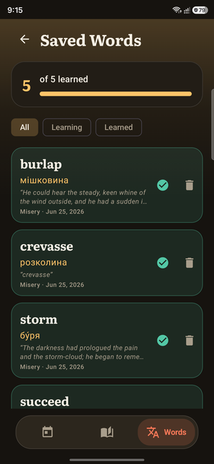

# Using Lexora

A friendly tour of everything in the app. **Lexora works fully offline** — no
account, no sign-in, no network needed (except a one-time translation-model
download, see [Translate](#translate-a-word-or-sentence)).

## Getting around

The app has three tabs on the floating bar at the bottom:

| Tab | What it is |
| --- | --- |
| 🗓️ **Today** | Your dashboard — reading streak, this month's activity, daily goal, level/XP. |
| 📖 **Library** | Your books. Import EPUBs and open them here. |
| 🅰️ **Words** | Your saved vocabulary and the review (flashcards) session. |

Tap a tab to switch. The active tab is coloured and shows its label.

<p align="center">
  
  
  
</p>

---

## Add a book

Open the **Library** tab and tap the **＋** button (top-right; on an empty
library it's the big button in the middle). Pick an `.epub` file from your phone.

Imported books appear on the shelf with generated cover art and your reading
progress. The book you read most recently sits at the top as **Continue reading**.

**Long-press a book** for **Details** or **Delete**.

> Lexora reads `.epub` files. You can get free public-domain books from sites like
> [Project Gutenberg](https://www.gutenberg.org) and open them here.

---

## Read

Tap a book to open it.

- **Turn pages** — swipe left/right (or switch to scrolling in settings).
- **Show / hide the toolbar** — tap the **top edge** of the page. It auto-hides
  while you read so nothing is in your way.

When the toolbar is visible you get, from the top bar:

| Button | Does |
| --- | --- |
| **←** Back | Return to your library. |
| **☰** Table of contents | Jump to any chapter. |
| **🔍** Search | Find any text in the book; tap a result to jump there. |
| **🔖** Bookmark | Save your spot. Tap again to remove it. |
| **Aa** | Open reading settings (see [Make it yours](#make-it-yours)). |

At the **bottom** you'll see the current chapter and a **scrubber** — drag it to
move anywhere in the book.

---

## Translate a word or sentence

This is the heart of Lexora.

<p align="center">
  
</p>

- **Tap a word** → a sheet slides up with its **IPA pronunciation**, **part of
  speech**, English **definitions**, and a **Ukrainian translation**. If the word
  isn't in the bundled dictionary, an offline machine translation fills in.
- **Tap the 🔊 speaker** next to the word to hear it pronounced.
- **Long-press** a word → translate the **whole sentence** around it.
- Tap **Save** on the sheet to add the word (with the sentence it came from) to
  your vocabulary.

> **One-time setup:** the first time you translate something the app may say it
> needs to download the translation model. Connect to the internet once and tap
> again — after that, translation works fully offline.

---

## Make it yours

Open a book and tap **Aa** in the toolbar. Everything updates as you turn the
next page.

- **Theme** — Light, Sepia, Dark, AMOLED, Paper, Nord, Solarized Dark, Gruvbox,
  Dusk.
- **Font** — Default, Serif, Sans, Literata, Lora, Atkinson Hyperlegible, Inter,
  OpenDyslexic. Each chip previews in its real typeface.
- **Font size**, **line spacing**, **margins**.
- **Page mode** — paginated (swipe) or scrolling.
- **Brightness** and **warmth** (a warm amber tint for night reading).
- **Highlight saved words** — underline words you've already saved as you read.
- **Lock rotation** — keep the screen from rotating while you read.

### Brightness gesture

Swipe **up / down along the right edge** of the page to brighten or dim — like a
video player. It won't interfere with tapping words or turning pages.

---

## Words — your vocabulary

The **Words** tab lists everything you've saved.

- A bar at the top shows how many words you've **learned** out of your total.
- **Filter** by **All / Learning / Learned**.
- Tap the **✓ check** on a card to mark a word **learned** (its card turns teal).
- **Tap any card** to reopen its full dictionary entry.
- **Delete** a word with the trash icon.

### Review (flashcards)

Tap the **Review** card to start a spaced-repetition session of the words that
are **due**. For each card, reveal the answer and rate how well you knew it:

- **Again** — you forgot it; it comes back soon.
- **Good** — you knew it; it's scheduled further out.
- **Easy** — you knew it instantly; scheduled even further out.

Reviewing and learning words earns **XP** and keeps your daily **streak** alive.

---

## Today — your progress

The **Today** tab is your dashboard:

- **Streak** — consecutive days you've read, saved, or reviewed a word.
- **This month** — a calendar heatmap; darker cells mean more activity that day.
- **Daily goal** — a small target (e.g. 5 words) with a progress ring.
- **Level & XP** — you level up by saving, reviewing, and learning words.
- **Stats** — words learning/learned, books in progress/finished.

Reading any book, saving a word, or doing a review all count toward your day.

---

## Tips

- **Everything is local.** Your books, words, and progress stay on your device.
- **No book yet?** Import any `.epub` to start — tapping words to translate is the
  fastest way to begin building vocabulary.
- Lost the toolbar while reading? Tap the **top edge** of the page to bring it
  back.

---

## For developers

Requirements: Android Studio (JDK 21), Android SDK (compileSdk 36), a device or
emulator on API 26+.

```bash
./gradlew :app:installDebug      # build and install (debug)
./gradlew testDebugUnitTest      # run unit tests
./gradlew :app:assembleRelease   # minified, per-ABI release APKs
```

Architecture and design decisions: [`../ARCHITECTURE.md`](../ARCHITECTURE.md).

The offline dictionary database is generated by a dev-time script in
`tools/dictionary/` from a [kaikki.org](https://kaikki.org) Wiktextract extract;
the prebuilt database ships in the app, so you don't need to run it.

To sign release builds, create a keystore and a gitignored `keystore.properties`
at the repo root; without it, release builds fall back to debug signing.
